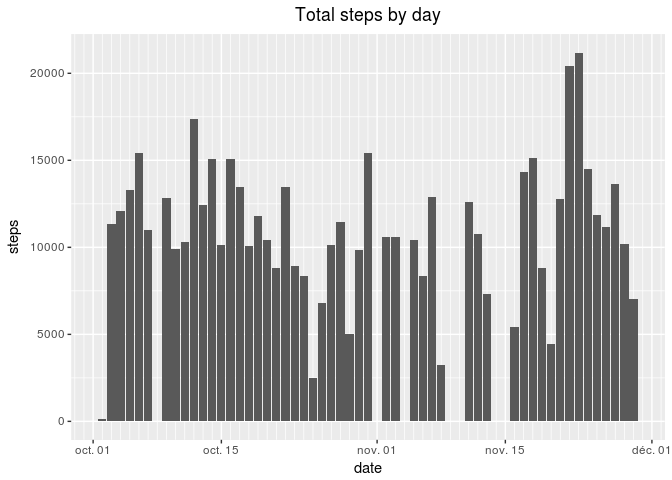
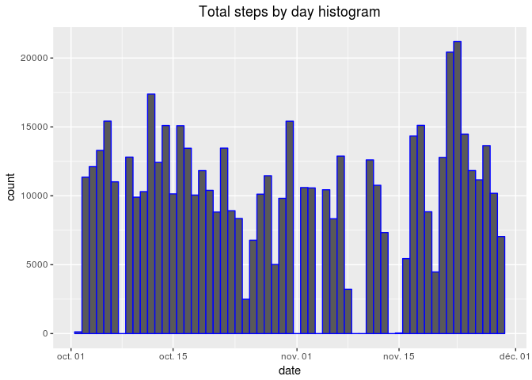
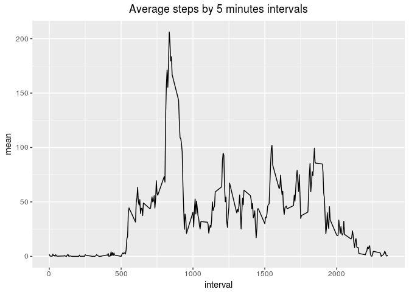
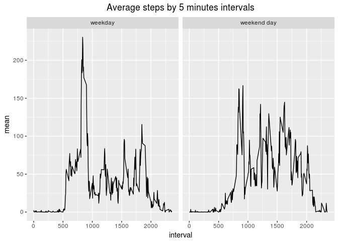

Analyse from an activity monitoring device
==========================================

<br /><br />

Introduction
------------

<br /><br />

In this project, we will analyse the data collected from an activity monitoring device. The data show up the number of steps performed by an anonymous person. The data was collected from October to November 2012, with 5 minutes interval each day.

<br /><br />

I. Preparation
--------------

<br /><br />

### A. Loading of useful library

<br />

In the purpose to be able to use some functions, we will load some packages.

``` r
library(data.table)
library(plyr)
library(dplyr)
```

    ## 
    ## Attaching package: 'dplyr'

    ## The following objects are masked from 'package:plyr':
    ## 
    ##     arrange, count, desc, failwith, id, mutate, rename, summarise,
    ##     summarize

    ## The following objects are masked from 'package:data.table':
    ## 
    ##     between, first, last

    ## The following objects are masked from 'package:stats':
    ## 
    ##     filter, lag

    ## The following objects are masked from 'package:base':
    ## 
    ##     intersect, setdiff, setequal, union

``` r
library(ggplot2)
library(reshape2)
```

    ## 
    ## Attaching package: 'reshape2'

    ## The following objects are masked from 'package:data.table':
    ## 
    ##     dcast, melt

``` r
library(gridExtra)
```

    ## 
    ## Attaching package: 'gridExtra'

    ## The following object is masked from 'package:dplyr':
    ## 
    ##     combine

<br />

### B. Get the data on the computer

<br />

In this step, we have to download and extract all the data we need.

``` r
if(!file.exists('data.zip')){
        download.file('https://d396qusza40orc.cloudfront.net/repdata%2Fdata%2Factivity.zip', destfile = 'data.zip')
}

if(!file.exists('activity.csv')){
        unzip('data.zip')
}
```

<br />

### C. Creation of the raw dataset

<br />

At the moment we have all the data on our computer, we can fread it into R. For this dataset, we will keep all the missing value.

``` r
data <-fread('activity.csv', na.strings = 'NA', sep = ',')
```

<br />

We can also think about to change the class of the 'date' column.

``` r
data <- as.data.frame(data)
data[ , 'date'] <- as.Date(data[ , 'date'], '%Y-%m-%d')
```

<br />

### D. Prepartion of a clean dataset called 'clean\_data'

<br />

In order to be ready before our exploratory analysis, we will create a clean dataset from the raw dataset.

<br />

**Step 1 : Localise all the observations with missing steps values**

``` r
result_1 <- data[is.na(data[ , 'steps']), ]
result_1 <- select(result_1, c(date, interval))
```

<br />

**Step 2 : Compute the mean of each interval**

``` r
result_2 <- data[complete.cases(data),]
result_2 <- aggregate(result_2[ , 'steps'], by = list ( interval = result_2[ , 'interval'] ), FUN = mean )
result_2 <- rename( result_2, steps = 'x' )
```

<br />

**Step 3 : Merge the identified row and its means computed before**

``` r
result <- merge(result_1, result_2, by = 'interval', all = TRUE)
result <- select(result, c(steps, date, interval))
rm(result_1, result_2)
```

<br />

**Step 4 : Combine the real completed rows and the rows completed by approximation**

``` r
result <- rbind(result, data[complete.cases(data),])
result <- result[order(result[,'date']), ]
```

<br />

**Step 5 : Creation of the clean dataset**

``` r
clean_data <- result
rm(result)
```

<br /><br />

Exploratory analysis
--------------------

<br /><br />

In this part, we will try to give an answer to different question.

<br /><br />

### What is mean total number of steps taken per day?

<br /><br />

**Calculate the total number of steps taken per day.**

<br />

1.  Compute the number of steps by day

``` r
result <- data[complete.cases(data),]
result <- aggregate(result[ , 'steps'], by = list ( date = result[ , 'date'] ), FUN = sum )
result <- rename( result, steps = 'x' )
```

<br />

1.  Plot the result

``` r
plot <- ggplot(data = result) + aes(x = date, y = steps)
plot <- plot + ggtitle('Total steps by day') + theme(plot.title = element_text(hjust =  0.5))
plot <- plot + geom_bar(stat = 'identity') + scale_x_date(date_minor_breaks = '1 day')
print(plot)
```



<br /><br />

**Make a histogram of the total number of steps taken each day.**

<br />

1.  Compute the number of steps by day

``` r
result <- data[complete.cases(data),]
result <- aggregate(result[ , 'steps'], by = list ( date = result[ , 'date'] ), FUN = sum )
result <- rename(result, steps = 'x' )
result <- result[rep(row.names(result), result[ , 'steps'] ), ]
```

<br />

1.  Plot the result

``` r
plot <- ggplot(data = result) + aes(date)
plot <- plot + ggtitle('Total steps by day histogram') + theme(plot.title = element_text(hjust =  0.5))
plot <- plot + geom_histogram(binwidth = 1, colour='blue')
print(plot)
```



<br /><br />

**Calculate and report the mean and median of the total number of steps taken per day.**

<br />

1.  Compute the centrals tendencies of steps by day

``` r
result <- data[complete.cases(data),]

result_1 <- aggregate(result[ , 'steps'], by = list ( date = result[ , 'date'] ), FUN = mean )
result_1 <- rename( result_1, mean = 'x' )

result_2 <- aggregate(result[ , 'steps'], by = list ( date = result[ , 'date'] ), FUN = median )
result_2 <- rename( result_2, median = 'x' )

result <- merge(result_1, result_2, by = 'date')
result <- melt(result, id.vars = 'date')

rm(result_1, result_2)
```

<br />

1.  Plot the result

``` r
plot <- ggplot(data = result) + aes(x = date, y = value)
plot <- plot + ggtitle('Steps by day') + theme(plot.title = element_text(hjust =  0.5))
plot <- plot + geom_line(aes(col = variable))
plot <- plot + scale_x_date(date_minor_breaks = '1 day')
print(plot)
```


<br /><br />

### What is the average daily activity pattern?

<br /><br />

**Make a time series plot of the 5-minute interval (x-axis) and the average number of steps taken, averaged across all days (y-axis).**

<br />

1.  Compute the average steps by 5 minutes intervals

``` r
result <- data[complete.cases(data),]
result <- aggregate(result[ , 'steps'], by = list ( interval = result[ , 'interval'] ), FUN = mean )
result <- rename( result, mean = 'x' )
```

<br />

1.  Plot the result

``` r
plot <- ggplot(data = result) + aes(x = interval, y = mean)
plot <- plot + ggtitle('Average steps by 5 minutes intervals') + theme(plot.title = element_text(hjust =  0.5))
plot <- plot + geom_line()
print(plot)
```



<br />

**Which 5-minute interval, on average across all the days in the dataset, contains the maximum number of steps ?**

<br />

1.  Compute the total steps by 5 minutes intervals

``` r
result <- data[complete.cases(data),]
result <- aggregate(result[ , 'steps'], by = list ( interval = result[ , 'interval'] ), FUN = sum )
result <- rename( result, steps = 'x' )

max <- max(result[ ,'steps'])
result <- result[ result[ ,'steps'] == max, ]

value_1 <- result[[1]]
value_2 <- result[[2]]
rm(max, result)
```

The interval which contains the maximum steps is 835, with 10927 steps.

<br /><br />

### Imputing missing values

<br /><br />

**Calculate and report the total number of missing values in the dataset.**

<br />

1.  Compute the number of NA

``` r
result <- data[is.na(data[ , 'steps']), ]
result <- nrow(result)
```

There are 2304 observations with missing values.

<br />

**Devise a strategy and create a new dataset that is equal to the original dataset but with the missing data filled in.**

<br />

The strategy was realized at the top of the page.

We can see an overview of the raw dataset here.

``` r
head(data)
```

    ##   steps       date interval
    ## 1    NA 2012-10-01        0
    ## 2    NA 2012-10-01        5
    ## 3    NA 2012-10-01       10
    ## 4    NA 2012-10-01       15
    ## 5    NA 2012-10-01       20
    ## 6    NA 2012-10-01       25

And an overview of the cleaned and filled dataset here.

``` r
head(clean_data)
```

    ##        steps       date interval
    ## 1  1.7169811 2012-10-01        0
    ## 10 0.3396226 2012-10-01        5
    ## 17 0.1320755 2012-10-01       10
    ## 29 0.1509434 2012-10-01       15
    ## 33 0.0754717 2012-10-01       20
    ## 45 2.0943396 2012-10-01       25

<br />

**What is the impact of imputing missing data on the estimates of the total daily number of steps ?**

<br />

**Plot 1**

<br />

1.  Compute the number of steps by day from the raw dataset

``` r
result_1 <- data[complete.cases(data),]
result_1 <- aggregate(result_1[ , 'steps'], by = list ( date = result_1[ , 'date'] ), FUN = sum )
result_1 <- rename(result_1, steps = 'x' )
result_1 <- result_1[rep(row.names(result_1), result_1[ , 'steps'] ), ]

source <- rep('raw data', nrow(result_1) )
result_1 <- cbind(result_1, source)
```

<br />

1.  Compute the number of steps by day from the clean dataset

``` r
result_2 <- clean_data[complete.cases(clean_data),]
result_2 <- aggregate(result_2[ , 'steps'], by = list ( date = result_2[ , 'date'] ), FUN = sum )
result_2 <- rename(result_2, steps = 'x' )
result_2 <- result_2[rep(row.names(result_2), result_2[ , 'steps'] ), ]

source <- rep('clean data', nrow(result_2) )
result_2 <- cbind(result_2, source)
```

<br />

1.  Prepare all the data for the plotting

``` r
result <- rbind(result_1, result_2)
rm(source, result_1, result_2)

plot1_result <- result
```

<br />

1.  Plot creation

``` r
plot_1 <- ggplot(data = plot1_result) + aes(date, color = source)
plot_1 <- plot_1 + ggtitle('Total steps by day') + theme(plot.title = element_text(hjust =  0.5))
plot_1 <- plot_1 + geom_histogram(fill = 'white', binwidth = 1, alpha = 0.5)
```

<br />

**Plot 2**

<br />

1.  Compute the centrals tendencies of steps by day from raw dataset

``` r
result <- data[complete.cases(data),]

result_1 <- aggregate(result[ , 'steps'], by = list ( date = result[ , 'date'] ), FUN = mean )
result_1 <- rename( result_1, mean = 'x' )

result_2 <- aggregate(result[ , 'steps'], by = list ( date = result[ , 'date'] ), FUN = median )
result_2 <- rename( result_2, median = 'x' )

result <- merge(result_1, result_2, by = 'date')
result <- melt(result, id.vars = 'date')
rm(result_1, result_2)

plot2_result <- result
```

<br />

1.  Plot creation

``` r
plot_2 <- ggplot(data = plot2_result) + aes(x = date, y = value)
plot_2 <- plot_2 + ggtitle('Steps by day from the raw dataset') + theme(plot.title = element_text(hjust =  0.5))
plot_2 <- plot_2 + geom_line(aes(col = variable))
plot_2 <- plot_2 + scale_x_date(date_minor_breaks = '1 day')
```

<br />

**Plot 3**

<br />

1.  Compute the centrals tendencies of steps by day from clean dataset

``` r
result <- clean_data[complete.cases(clean_data),]

result_1 <- aggregate(result[ , 'steps'], by = list ( date = result[ , 'date'] ), FUN = mean )
result_1 <- rename( result_1, mean = 'x' )

result_2 <- aggregate(result[ , 'steps'], by = list ( date = result[ , 'date'] ), FUN = median )
result_2 <- rename( result_2, median = 'x' )

result <- merge(result_1, result_2, by = 'date')
result <- melt(result, id.vars = 'date')
rm(result_1, result_2)

plot3_result <- result
```

<br />

1.  Plot creation

``` r
plot_3 <- ggplot(data = plot3_result) + aes(x = date, y = value)
plot_3 <- plot_3 + ggtitle('Steps by day from the clean dataset') + theme(plot.title = element_text(hjust =  0.5))
plot_3 <- plot_3 + geom_line(aes(col = variable))
plot_3 <- plot_3 + scale_x_date(date_minor_breaks = '1 day')
```

<br />

**Print all the plot**

``` r
grid.arrange(plot_1, plot_2, plot_3)
```


<br /><br />

Are there differences in activity patterns between weekdays and weekends ?
--------------------------------------------------------------------------

<br /><br />

**Make a panel plot containing a time series plot (i.e. 𝚝𝚢𝚙𝚎 = "𝚕") of the 5-minute interval (x-axis) and the average number of steps taken, averaged across all weekday days or weekend days (y-axis).**

<br />

1.  Addition of a new column

``` r
day <- weekdays(clean_data[ , 'date'])
result <- cbind(clean_data, day)
result[ , 'day'] <- gsub('lundi|mardi|mercredi|jeudi|vendredi', 'weekday', result[ , 'day'])
result[ , 'day'] <- gsub('samedi|dimanche', 'weekend day', result[ , 'day'])
```

<br />

1.  Compute of the average steps by 5 minutes intervals

``` r
result <- aggregate(result[ , 'steps'], by = list ( interval = result[ , 'interval'], day = result[ , 'day'] ), FUN = mean )
result <- rename( result, mean = 'x' )
```

<br />

1.  Plot the result

``` r
plot <- ggplot(data = result) + aes(x = interval, y = mean) + facet_grid(.~day)
plot <- plot + ggtitle('Average steps by 5 minutes intervals') + theme(plot.title = element_text(hjust =  0.5))
plot <- plot + geom_line()
print(plot)
```


